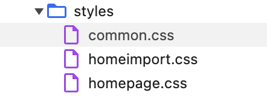

# Website Inspection: International Children's Digital Library (ICDL)

## URL
[International Children's Digital Library](http://www.childrenslibrary.org/)

## Web Technologies Used
- **HTML**: The site uses standard HTML to structure the content of the website. This includes elements like headings, paragraphs, and links.
- **CSS**: Several `.css` files are used to handle the styling of the website, including fonts, layouts, and color schemes.
- **JavaScript**: Multiple `.js` files are used for interactive features such as search functionality and navigation controls.

## Development Team
The website was created and maintained by the **International Children's Digital Library Foundation**. Additional details about the team can be found 
in the footer of the site or on the [About Us page](http://www.childrenslibrary.org/icdl/SimpleSearchCategory?ilang=English).

## Screenshots

### CSS Inspection

### JavaScript Inspection
